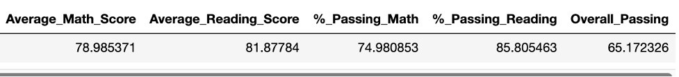
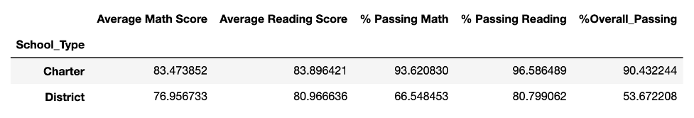
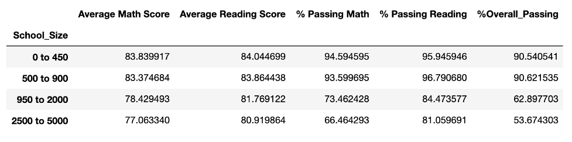
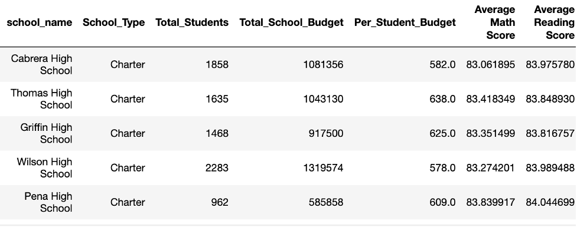
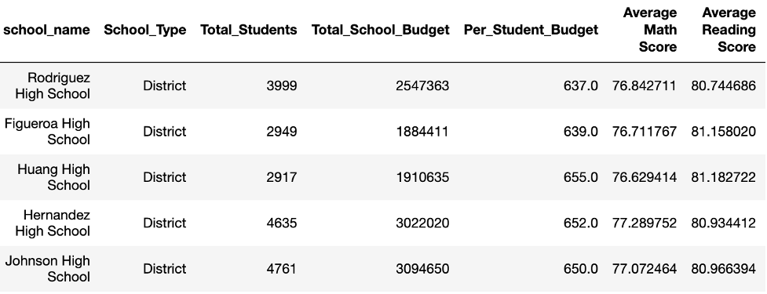

# pandas-challenge
 pandas homework

**Analysis**

Overall percent passing score is extremely low as the analysis revealed the top five school types being Charter while the lower being District schools. The larger sized schools fall within the lower end of the overall passing.

**District Summary**

 

**Scores by School Type**

 
#
#

**Scores by School Size**

 

**Top Performing Schools**

 

**Bottom Performing Schools**
 

